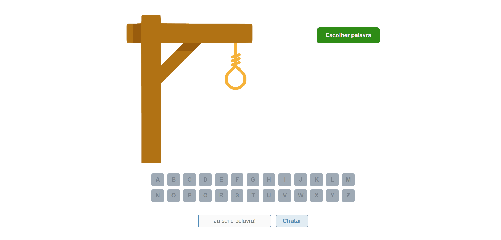

# Jogo da Forca

Esse é um clássico! Quem nunca jogou o jogo da forca na escola? Ou então, com os amigos? 

Esse projeto tem a proposta de relembrar os bons momentos que passamos jogando esse game, mas dessa vez, com uma interface dinâmica e atrativa, de fácil usabilidade e com uma grande variedade de palavras.

Para jogar é simples, veja:

  * A primeira coisa a ser feita é clicar no botão "Escolher palavra";
  * Nesse momento, a palavra será escolhida pelo game e os botões serão desbloqueados. Seu objetivo será descobrir qual é a palavra;
  * ``OBS``: você notará que aparecerá alguns traços, eles irão indicar o tamanho da palavra escolhida;
  * Agora, você já poderá tentar descobrir qual é a palavra. Para isso, é só clicar na letra desejada;
  * Caso você escolha alguma letra que não exista na palavra, o bonequinho começará a se formar na forca;
  * Se o bonequinho for enforcado é **Game over**;
  * Caso você já saiba qual é a palavra, você pode escrever no campo "Já sei a palavra" e chutar.

---

## Confira o design e usabilidade do game:

<p align="start">
  
</p>

- Você pode acessar essa aplicação nesse link:
  [https://jogo-da-forca-woad.vercel.app/](https://jogo-da-forca-woad.vercel.app/)

- Você também pode acessar o repositório de outro game clássico, que foi feita usando **HTML**:
  [https://github.com/Nicoladla/ParrotCardGame](https://github.com/Nicoladla/ParrotCardGame)

---

## Informações técnicas

Essa aplicação foi desenvolvida utilizando as tecnologias:

- CSS
- JavaScript
- React.js
- Styled Components

### Como iniciar o projeto na minha máquina?

- O primeiro passo é você fazer o download do projeto para sua máquina: [Download ZIP](https://github.com/Nicoladla/JogoDaForca/archive/refs/heads/main.zip)

- Ou então clonar esse repositório através do seu terminal:

  ```
  git clone https://github.com/Nicoladla/JogoDaForca.git
  ```

- Com o projeto na sua máquina, abra o seu editor de código favorito e então, dentro do seu projeto no seu terminal, execute o comando:

  ```
  npm install
  ```

- Após isso, basta inicializar sua aplicação:

  ```
  npm start
  ```

- Por fim, ao executar esse comando, uma janela no seu navegador se abrirá com a aplicação, mas caso isso não ocorra, você poderá acessá-lá colocando esse link no seu navegador:
  ```
  localhost:3000/
  ```
